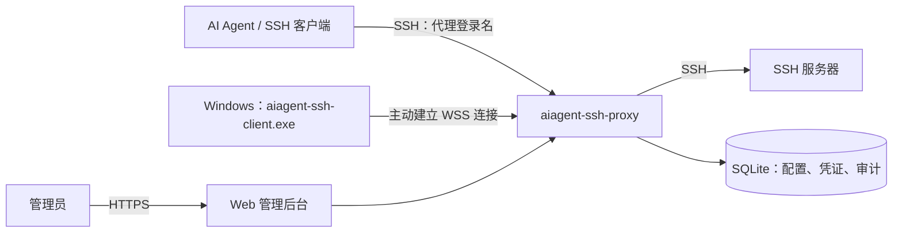

# aiagent-ssh-proxy

为 AI Agent 提供统一 SSH 入口的运维代理。集中管理服务器和访问凭证，按代理登录名连接目标主机，并记录命令与会话审计。

支持直接连接 SSH 服务器，也支持 Windows 客户端主动接入，无需在 Windows 上安装 OpenSSH 或开放入站端口。

## 架构设计



- **统一入口**：客户端使用代理登录名访问主机，代理验证客户端凭证及主机授权后转发请求。
- **SSH 接入**：代理使用服务器凭证连接目标机器，AI Agent 无需持有目标机器的密码或私钥。
- **Windows 接入**：客户端通过 HTTPS 入口建立 `/agent` WebSocket 连接，接收命令并返回 PowerShell 执行结果。
- **集中管理**：内置 Ant Design Pro 管理后台，支持服务器、凭证、当前连接、审计日志和服务设置。
- **数据存储**：使用 SQLite 保存配置和审计；服务器密码、私钥使用 AES-GCM 加密，备份时需同时保留数据库和配套密钥文件。

## Windows 客户端

在“服务设置”保存公网 HTTPS 地址，生成并保存自注册 Token，然后在 Windows 上运行：

```powershell
.\aiagent-ssh-client.exe -token '自注册Token' -hostname 'es-windows-01'
```

Token 包含连接地址；省略 `-hostname` 时使用系统主机名。注册后需在后台手动关联客户端凭证，才能通过 SSH 访问。

Windows 当前支持非交互命令和通过命令读取文件，每台主机同时执行一个任务，最长 5 分钟；不支持 SFTP、PTY、stdin 和端口转发。

## 部署与安全

- Linux 服务端：`aiagent-ssh-proxy`；Windows 客户端：`aiagent-ssh-client.exe`。
- 默认 SSH 端口为 `2222`，Web 服务监听 `127.0.0.1:8080`；公网 HTTPS / WSS 由 Nginx 或 Caddy 提供。
- 当前不建议将管理后台直接向所有公网访客开放：尚缺登录限流、服务端会话撤销，以及 HTTP 超时和普通 JSON 请求体大小限制。
- 建议公网仅开放 `/agent`，管理后台和 `/api/` 限 VPN 或可信 IP 访问，禁止直接访问后端 `8080`；SSH 入口单独限制来源。

## 相关资料

- [下载发布包](https://github.com/kingsh2012/claude-ssh-proxy/releases)
- [Windows 接入与部署说明](docs/20260911-windows-agent.md)
- [前端开发说明](webui/README.md)
