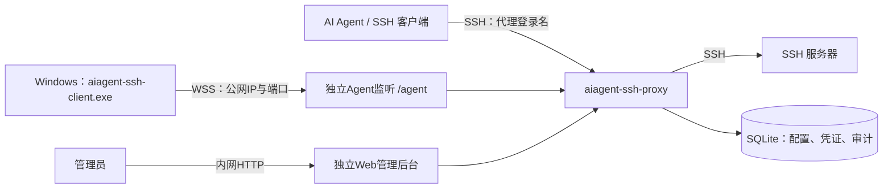

# aiagent-ssh-proxy

为AI Agent提供统一SSH入口的运维代理。集中管理服务器和访问凭证，按代理登录名连接目标主机，并记录命令与会话审计。

支持直接连接SSH服务器，也支持Windows客户端主动接入，无需在Windows上安装OpenSSH或开放入站端口。

## 架构设计



- **统一入口**：客户端使用代理登录名访问主机，代理验证客户端凭证及主机授权后转发请求。
- **SSH接入**：代理使用服务器凭证连接目标机器，AI Agent无需持有目标机器的密码或私钥。
- **Windows接入**：客户端通过独立Agent入口建立`/agent` WebSocket连接，接收命令并返回PowerShell执行结果。
- **集中管理**：内置Ant Design Pro管理后台，支持服务器、凭证、当前连接、审计日志和服务设置。
- **数据存储**：使用SQLite保存配置和审计；服务器密码、私钥使用AES-GCM加密，备份时需同时保留数据库和配套密钥文件。

## Windows客户端

在“服务设置”保存公网WSS地址（wss://proxy.example.com/agent）或HTTPS主域名（https://proxy.example.com），在“服务器自注册”中生成并保存Token，然后在Windows上运行：

```powershell
.\aiagent-ssh-client.exe -token '自注册Token' -hostname 'es-windows-01'
```

Token包含连接地址；省略 `-hostname` 时使用系统主机名。注册后需在后台手动关联客户端凭证，才能通过SSH访问。

Windows当前支持非交互命令和通过命令读取文件，每台主机同时执行一个任务，最长 5 分钟；不支持SFTP、PTY、stdin和端口转发。

## 部署与安全

- Linux服务端：`aiagent-ssh-proxy`；Windows客户端：`aiagent-ssh-client.exe`。
- 默认SSH端口为`2222`；Web仅HTTP，默认`127.0.0.1:8080`；Agent独立监听`127.0.0.1:8081`，只提供`/agent`。
- 在服务设置中修改Web/Agent监听地址、Agent内置TLS开关及PEM证书、私钥路径，保存后重启生效。Web不提供内置TLS。
- Agent启用TLS后可直接映射公网端口，使用`wss://公网IP:端口/agent`；证书需包含该公网IP。客户端可在构建时嵌入部署CA公钥证书，仍校验IP、证书有效期和证书链。
- 不启用内置TLS时，使用Nginx或Caddy为独立Agent监听提供WSS入口。旧反向代理的`/agent`上游须从Web端口迁到Agent端口。
- 当前不建议将管理后台直接向所有公网访客开放：尚缺登录限流、服务端会话撤销，以及普通JSON请求体大小限制。
- 建议公网仅开放 `/agent`，管理后台和 `/api/` 限VPN或可信IP访问，禁止直接访问后端 `8080`；SSH入口单独限制来源。

## 相关资料

- [下载发布包](https://github.com/kingsh2012/claude-ssh-proxy/releases)
- [Windows接入与部署说明](docs/20260911-windows-agent.md)
- [前端开发说明](webui/README.md)
